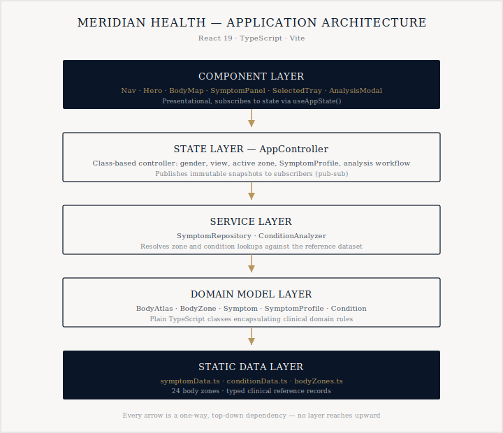
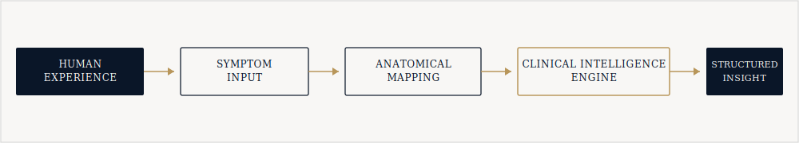
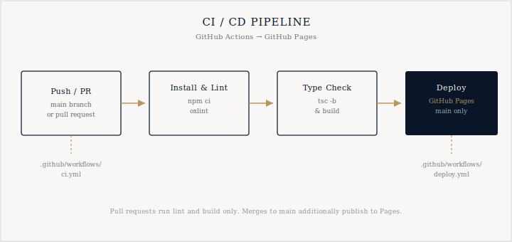

<p align="center">
  
</p>

<p align="center">
  
  
  
  
  
</p>

<p align="center">
  A clinical symptom intelligence experience built around an interactive, anatomically accurate body map.<br />
  Select a region, describe what you feel, and receive a physician-informed set of possibilities.
</p>

---

## Overview

Meridian Health is a static single-page application that lets a person explore symptoms by
pointing directly at a body region on a photoreal mannequin. Each of the 24 mapped regions opens
a curated symptom panel; selections feed a lightweight analysis engine that returns ranked
candidate conditions with specialty referrals.

This repository is a full migration of the original static HTML/CSS/JS prototype into a
production React and TypeScript application, organized around a clear object-oriented domain
model rather than ad-hoc DOM manipulation.

**Live demo:** deployed automatically to GitHub Pages on every push to `main`.

## What changed in this migration

| Area | Before | After |
|---|---|---|
| Language | Vanilla JavaScript | TypeScript, strict mode |
| UI | Direct DOM manipulation | React 19 function components |
| State | Global mutable variables | `AppController` class with a pub-sub snapshot model |
| Domain logic | Inline in `app.js` | `BodyZone`, `Symptom`, `SymptomProfile`, `Condition`, `BodyAtlas` classes |
| Body map alignment | Hand-estimated coordinates, visibly offset from the artwork | Recalibrated against a sampled pixel grid on each source image |
| View coverage | Front view only | Front **and** back view toggle, for both body types |
| Deployment | None | GitHub Actions build and deploy to GitHub Pages, with a separate PR-validation workflow |
| Tooling | None | Static analysis linting (oxlint), TypeScript project references, Vite build |

## Architecture

The application is organized as five strictly layered concerns. Components never talk to data
directly, and no layer reaches back upward.

<p align="center">
  
</p>

- **Component layer** — presentational React components (`Nav`, `Hero`, `BodyMap`, `SymptomPanel`,
  `SelectedTray`, `AnalysisModal`, `HowItWorks`, `Footer`). They read state through `useAppState()`
  and never hold business logic.
- **State layer** — `AppController`, a plain TypeScript class that owns every piece of interactive
  state (selected body type, view side, active zone, running `SymptomProfile`, and the analysis
  workflow) and publishes immutable snapshots to subscribers.
- **Service layer** — `SymptomRepository` and `ConditionAnalyzer`, which resolve zone and condition
  lookups against the reference dataset.
- **Domain model layer** — `BodyAtlas`, `BodyZone`, `Symptom`, `SymptomProfile`, and `Condition`:
  small, independently testable classes that encapsulate the clinical domain rules.
- **Static data layer** — typed reference data (`symptomData.ts`, `conditionData.ts`,
  `bodyZones.ts`) generated from the original dataset.

### Symptom-to-analysis flow

<p align="center">
  
</p>

## Body map alignment

The original prototype's hit regions were visibly offset from the mannequin artwork. Each source
image (1024 x 1536px, an exact 2:3 match to the 320 x 480 SVG viewBox) was resampled onto a 20px
reference grid, and every zone's shape and position were rebuilt by hand against that grid, per
body type and per view side. Front and back geometry is now defined independently for the male and
female mannequins, so hips, shoulders, and limb width track the correct silhouette instead of
sharing one generic outline.

## Features

- Interactive front/back, male/female anatomical body map with 24 selectable regions
- Physician-authored symptom panel per region, with severity selection (mild, moderate, severe)
- Persistent selected-symptoms tray that survives moving between regions
- Simulated analysis workflow returning ranked, specialty-tagged candidate conditions
- Fully keyboard-accessible zone selection (tab, enter, space) with ARIA labeling throughout
- Strict TypeScript domain model with zero `any` usage
- GitHub Actions CI on every pull request, and automatic Pages deployment on merge to `main`

## Getting started

```bash
npm install
npm run dev       # start the local dev server
npm run build     # type-check and produce a production build in dist/
npm run preview   # preview the production build locally
npm run lint      # run static analysis
```

## Deployment

Deployment is fully automated. Pushing to `main` triggers `.github/workflows/deploy.yml`, which
type-checks, builds, and publishes `dist/` to GitHub Pages via `actions/deploy-pages`. Pull
requests instead run `.github/workflows/ci.yml`, which lints and builds without deploying.

<p align="center">
  
</p>

To deploy under your own repository name, update the `base` value in `vite.config.ts` (or set the
`VITE_BASE_PATH` environment variable at build time) to match your Pages URL, then enable
**Settings -> Pages -> Source: GitHub Actions** on the repository.

## Project structure

```
src/
  models/          Domain classes: BodyAtlas, BodyZone, Symptom, SymptomProfile, Condition, types
  services/        SymptomRepository, ConditionAnalyzer
  state/           AppController and its React context/hook bridge
  data/            Typed static reference data and body zone geometry
  components/      React presentational components
  styles/          Application styles
public/
  mannikin/        Mannequin artwork (front/back, male/female)
docs/
  diagrams/        README illustrations
.github/workflows/ CI and Pages deployment
```

## Design system

| Color | Swatch | Usage |
|---|---|---|
| Navy `#0A1628` |  | Primary surface, headings |
| Gold `#B8965A` |  | Accent, active states |
| Ivory `#F8F7F5` |  | Background |
| Graphite |  | Secondary text |

Typography pairs Cormorant Garamond for display headings with Inter for interface text, an
editorial pairing intended to read as clinical rather than consumer-app casual.

## Disclaimer

Meridian Health is an informational tool. It does not provide medical diagnosis, advice, or
treatment, and is not a substitute for consultation with a qualified physician.

## License

Released under the [MIT License](LICENSE).
